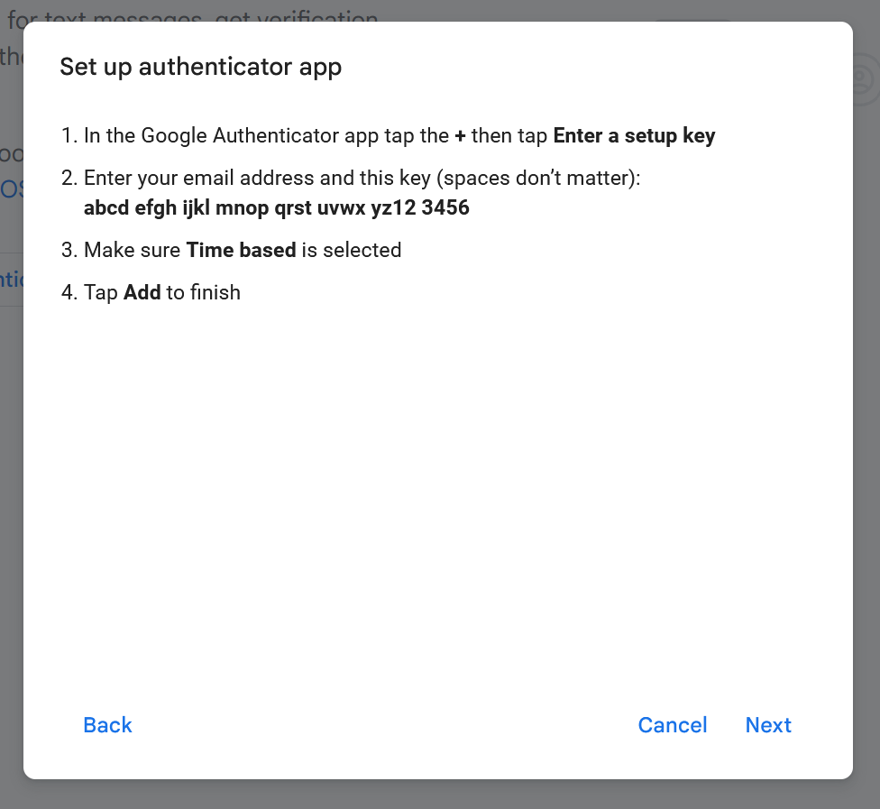
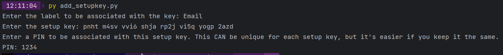
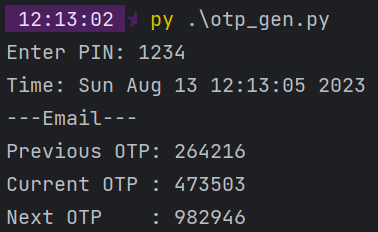

# otp_gen (clipboard variant)

A one-time password generator.

Modern OTPs are generated from a fixed, constant *setup key*. `otp_gen` stores that setup key, encrypting it with a user-defined passcode and decrypting it where necessary.
- The actual OTP is then generated based on the current timestamp (most implementations have 30-second interval timestamps) and the setup key.

This version prompts you first for the label of the OTP to obtain, then displays **only** the OTP for that label. 
For convenience, this OTP is also copied to the clipboard. This allows for an entirely keyboard-driven workflow -- enter the code and the number for the label, and the OTP is automatically saved in the clipboard for pasting.

## Installation
Install the required dependencies with:
```commandline
pip install -r requirements.txt
```

## Usage

### Adding a Setup Key
Generate a setup key with a PIN with:
```commandline
python add_setupkey.py
```

This will prompt you for:
1. A PIN code to be used to encrypt the setup key.
   - **Warning**: For security reasons, `otp_gen` does not store that PIN, so **don't lose it**. 
   - You might also want to set up a separate authenticator (e.g. using Google Authenticator) to ensure you can still log in if the encrypted setupkey is corrupted.
2. The label to be associated with the setup key (e.g. "Email")
3. The actual setup key. This can be obtained either from:
    - Scanning the QR code with a regular QR code reader:
      - This will give a URI: `otpauth://totp//...?secret=[SETUP KEY]&issuer=...`
      - The setup key can be manually extracted from that URI.
    - Obtaining the setup key directly:
      1. If using Google, click "Can't scan it?" when setting up the authenticator app.
      2. The setup key will be the given security key in step 2.
        

**Example**:    
(Note: The actual PIN will not be visible)    


### Requesting an OTP
```commandline
python otp_gen.py
```

This will prompt you for the PIN, and will output all OTPs for the previous, current and next time interval associated with the PIN.

**Example**:    
(Note: The actual PIN will not be visible)    
